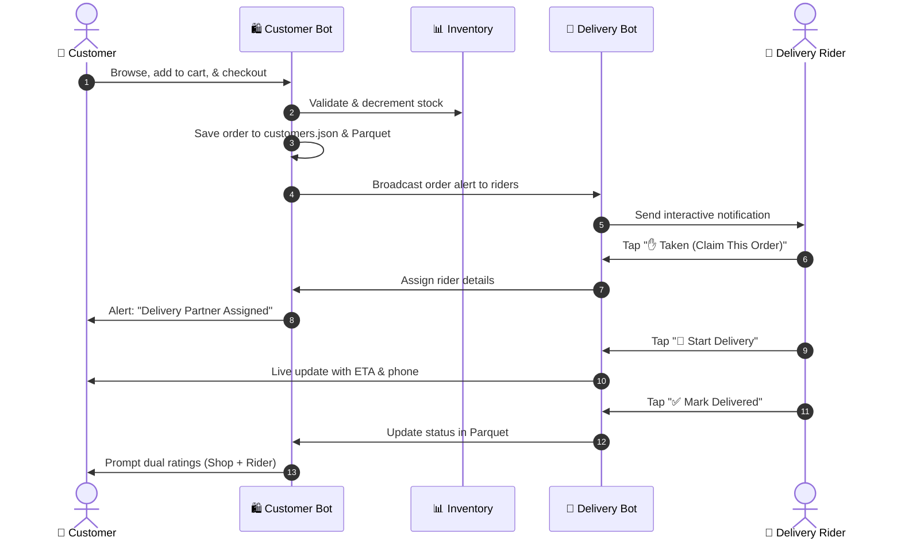

# 🤖 VyaparSync Telegram Bots Module

> **Unified Conversational Retail & Delivery Orchestration System**

This module contains the two integrated Telegram bots powering the VyaparSync retail ecosystem:

---

## 📁 Bots in this Module

| Sub-Module | Bot Purpose | Technology | Documentation |
|:---|:---|:---|:---|
| [`telegram-bot-customer/`](./telegram-bot-customer) | **Customer E-Commerce Storefront** (Shopping, Cart controls, Dynamic deals, 5-step checkout, Promo codes, 10-min cancellation, Schedules, Refunds, Feedback) | TypeScript, grammY, Python Parquet | [Customer Bot README](./telegram-bot-customer/README.md) |
| [`telegram-bot-delivery/`](./telegram-bot-delivery) | **Delivery Partner Dispatch & Tracking** (Rider login, Live claim pool, Status dispatching, Customer notes, Scorecards & review feed) | TypeScript, grammY, Python Parquet | [Delivery Bot README](./telegram-bot-delivery/README.md) |

---

## 🔄 Inter-Bot Workflow



---

## 🚀 Quick Start

### 1. Customer Bot
```bash
cd telegram-bot-customer
npm install
npx tsx bot.ts
```

### 2. Delivery Bot
```bash
cd telegram-bot-delivery
npm install
npx tsx bot.ts
```
