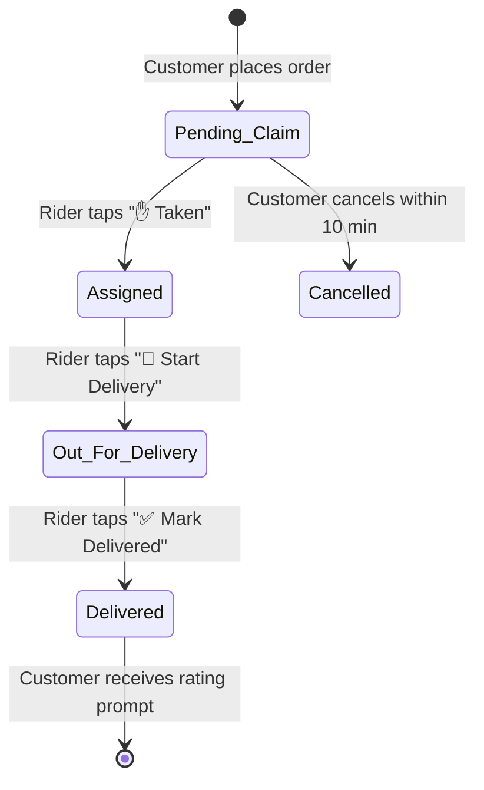

# 🚴 VyaparSync Delivery Agent Telegram Bot

> **An intelligent, real-time dispatch and fulfillment bot for hyper-local delivery partners.** Built with TypeScript, [grammY](https://grammy.dev/), and Python Parquet data bridge.

---

## 📖 Table of Contents
- [Architecture Overview](#-architecture-overview)
- [Key Features](#-key-features)
  - [1. Agent Authentication & Session Management](#1-agent-authentication--session-management)
  - [2. Instant Dispatch Broadcasts](#2-instant-dispatch-broadcasts)
  - [3. Live Order Claiming Pool](#3-live-order-claiming-pool)
  - [4. Real-Time Status Transitions & Customer Push Updates](#4-real-time-status-transitions--customer-push-updates)
  - [5. Rich Customer Insights (Parquet Integration)](#5-rich-customer-insights-parquet-integration)
  - [6. Customer Instructions & Promo Visibility](#6-customer-instructions--promo-visibility)
  - [7. Rider Performance Scorecards & Review Feed](#7-rider-performance-scorecards--review-feed)
  - [8. Earnings & Delivery History](#8-earnings--delivery-history)
- [Bot Commands Reference](#-bot-commands-reference)
- [Order Lifecycle State Machine](#-order-lifecycle-state-machine)
- [Project Structure](#-project-structure)
- [Environment Configuration](#-environment-configuration)
- [Installation & Execution](#-installation--execution)
- [Data Bridge & Python Integration](#-data-bridge--python-integration)

---

## 🏗️ Architecture Overview

The Delivery Agent Bot connects field delivery personnel directly with customer orders, the inventory system, and analytics data. When a customer places an order via the Customer Bot, an instant broadcast is pushed to all logged-in delivery agents, enabling rapid claiming and end-to-end status tracking.

```
┌─────────────────────────────────────────────────────────────┐
│                 Customer Bot (bot.ts)                       │
│             Order Placed / Cancelled Event                  │
└──────────────────────────────┬──────────────────────────────┘
                               │ Instant Cross-Bot Telegram Broadcast
                               ▼
┌─────────────────────────────────────────────────────────────┐
│                 Delivery Agent Telegram Bot                 │
│   - Session Store (agents.json)                             │
│   - Claim Pool & Status State Machine (bot.ts)              │
│   - Parquet Analytics Bridge (parquet_reader.py)            │
└──────────────┬───────────────────────────────┬──────────────┘
               │                               │
               ▼                               ▼
┌──────────────────────────────┐ ┌────────────────────────────┐
│      Customer Update API     │ │    Parquet & JSON Sync     │
│ (Push Status/ETA to Customer)│ │ (customers.json & Parquet) │
└──────────────────────────────┘ └────────────────────────────┘
```

---

## 🌟 Key Features

### 1. Agent Authentication & Session Management
- **Roster Selection:** Quick 1-tap profile selection for registered delivery riders (e.g., *Ramesh Kumar*, *Suresh Singh*, *Ankit Rao*).
- **Persistent Sessions:** Agent credentials, phone numbers, vehicle numbers, and session state are persisted in `agents.json`.
- **Seamless Re-login:** Agents remain logged in across bot restarts until explicitly logging out with `/logout`.

### 2. Instant Dispatch Broadcasts
- **Real-Time Notification:** As soon as an order is placed on the Customer Bot, all registered delivery agents receive an interactive broadcast alert.
- **Broadcast Content:** Includes Order ID, Customer Name, Loyalty Tier, Delivery Address, Item Summary, Total Amount, and Payment Mode (COD vs. UPI Prepaid).

### 3. Live Order Claiming Pool
- **1-Tap Claim:** Agents claim orders by tapping `"✋ Taken (Claim This Order)"`.
- **Race Condition Prevention:** The bot verifies that the order has not already been claimed by another agent before granting assignment.
- **Instant Customer Alert:** The customer receives a notification that their delivery partner has been assigned, along with the rider's name and vehicle information.

### 4. Real-Time Status Transitions & Customer Push Updates
Agents manage orders through a simple state machine with interactive inline buttons:
- **`🚀 Start Delivery`:**
  - Transitions order status to `Out for Delivery 🚀`.
  - Pushes an immediate notification to the customer with live ETA and the rider's contact number.
- **`✅ Mark Delivered`:**
  - Transitions order status to `Delivered ✅`.
  - Records timestamp and completion in `customers.json` and syncs to Parquet.
  - Automatically triggers the customer's 2-step rating prompt (Store Rating + Delivery Rider Rating).

### 5. Rich Customer Insights (Parquet Integration)
Riders view rich context from the Parquet data lake before and during delivery:
- **Customer Tier:** Identifies whether the customer is a `🌱 New`, `🛍️ Returning`, `⭐ Regular`, or `💎 VIP` shopper.
- **Order Count & Points:** Displays customer lifetime order history and loyalty points.
- **Customer Address & Contact:** Clear address and landmark information.

### 6. Customer Instructions & Promo Visibility
- **Special Delivery Notes:** Displays customer requests entered during checkout (e.g., *"Leave at the door"*, *"Ring bell twice"*, *"Call before arriving"*).
- **Payment Clarity:** Explicitly marks orders as `📱 UPI (Prepaid) — No cash collection needed` or `💵 Cash on Delivery — Collect ₹X`.
- **Promo Badge:** Displays applied promo codes so the rider can explain discounts if asked.

### 7. Rider Performance Scorecards & Review Feed
- **Performance Metrics (`/stats`):** Total orders delivered, completion rate, total earnings, and aggregate star rating.
- **Live Review Feed (`/reviews`):** Reads actual ratings and qualitative feedback submitted by customers after delivery completion.

### 8. Earnings & Delivery History
- **Command:** `/history`
- Displays a chronological list of completed deliveries with timestamps, earnings per trip, and payment modes.

---

## 🕹️ Bot Commands Reference

| Command | Description |
|:---|:---|
| `/start` | Launch bot, select agent profile, or view agent dashboard |
| `/orders` or `/active` | View all active orders currently assigned to you |
| `/available` or `/pool` | View unclaimed orders waiting in the order pool |
| `/history` | View your completed delivery history |
| `/stats` or `/scorecard` | View your total deliveries, rating average, and earnings |
| `/reviews` or `/ratings` | View customer ratings and feedback comments for your deliveries |
| `/logout` | Log out of the current delivery agent profile |
| `/help` | View delivery agent operational handbook and FAQs |

---

## 🔄 Order Lifecycle State Machine



---

## 📁 Project Structure

```
telegram-bot-delivery/
├── bot.ts                # Main grammY bot entry point & delivery workflows
├── parquet_reader.py     # Python bridge to read & update Parquet/JSON data
├── agents.json           # Agent roster, vehicle details & active sessions
├── package.json          # Node.js dependencies & scripts
├── tsconfig.json         # TypeScript compiler configuration
├── .env.example          # Template for environment variables
└── README.md             # This documentation
```

---

## ⚙️ Environment Configuration

Create a `.env` file inside `telegram-bot-delivery/` based on `.env.example`:

```env
TELEGRAM_BOT_TOKEN=your_delivery_bot_token_here
TELEGRAM_CHAT_ID=optional_agent_group_or_personal_chat_id
```

---

## 🚀 Installation & Execution

### 1. Install Node Dependencies
```bash
npm install
```

### 2. Install Python Dependencies
```bash
pip install pandas pyarrow
```

### 3. Start the Bot
```bash
npm start
# or directly with tsx:
npx tsx bot.ts
```

---

## 🐍 Data Bridge & Python Integration

The Delivery Bot utilizes `parquet_reader.py` via Python child process calls to maintain high-performance synchronization between the Node.js Telegram bot and the shared Parquet data lake.

### Supported Python Operations:
```bash
# Fetch orders assigned to a specific agent
python parquet_reader.py orders "Ramesh Kumar"

# Fetch full customer profile & history by Telegram Chat ID
python parquet_reader.py profile 123456789

# Update delivery status in customers.json and resync Parquet
python parquet_reader.py update_status ORD-12345 "Delivered ✅"

# Claim an unclaimed order
python parquet_reader.py claim ORD-12345 "Ramesh Kumar" "+919988776655"
```
